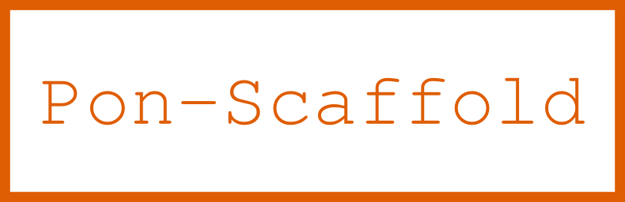

 


<!---
This file is generated by ape-tmpl. Do not update manually.
--->

<!-- Badge Start -->
<a name="badges"></a>

[![Build Status][bd_travis_shield_url]][bd_travis_url]
[![npm Version][bd_npm_shield_url]][bd_npm_url]
[![JS Standard][bd_standard_shield_url]][bd_standard_url]

[bd_repo_url]: https://github.com/realglobe-Inc/pon-scaffold
[bd_travis_url]: http://travis-ci.org/realglobe-Inc/pon-scaffold
[bd_travis_shield_url]: http://img.shields.io/travis/realglobe-Inc/pon-scaffold.svg?style=flat
[bd_travis_com_url]: http://travis-ci.com/realglobe-Inc/pon-scaffold
[bd_travis_com_shield_url]: https://api.travis-ci.com/realglobe-Inc/pon-scaffold.svg?token=
[bd_license_url]: https://github.com/realglobe-Inc/pon-scaffold/blob/master/LICENSE
[bd_codeclimate_url]: http://codeclimate.com/github/realglobe-Inc/pon-scaffold
[bd_codeclimate_shield_url]: http://img.shields.io/codeclimate/github/realglobe-Inc/pon-scaffold.svg?style=flat
[bd_codeclimate_coverage_shield_url]: http://img.shields.io/codeclimate/coverage/github/realglobe-Inc/pon-scaffold.svg?style=flat
[bd_gemnasium_url]: https://gemnasium.com/realglobe-Inc/pon-scaffold
[bd_gemnasium_shield_url]: https://gemnasium.com/realglobe-Inc/pon-scaffold.svg
[bd_npm_url]: http://www.npmjs.org/package/pon-scaffold
[bd_npm_shield_url]: http://img.shields.io/npm/v/pon-scaffold.svg?style=flat
[bd_standard_url]: http://standardjs.com/
[bd_standard_shield_url]: https://img.shields.io/badge/code%20style-standard-brightgreen.svg

<!-- Badge End -->


<!-- Description Start -->
<a name="description"></a>

Scaffold generator for pon

<!-- Description End -->


<!-- Overview Start -->
<a name="overview"></a>


<!-- Overview End -->


<!-- Sections Start -->
<a name="sections"></a>

<!-- Section from "doc/guides/01.Installation.md.hbs" Start -->

<a name="section-doc-guides-01-installation-md"></a>

Installation
-----

```bash
$ npm install pon-scaffold -g
```


<!-- Section from "doc/guides/01.Installation.md.hbs" End -->

<!-- Section from "doc/guides/02.Usage.md.hbs" Start -->

<a name="section-doc-guides-02-usage-md"></a>

Usage
---------

```javascript
#!/usr/bin/env node

'use strict'

const ponScaffold = require('pon-scaffold')

// Generate module project
ponScaffold(
  'task', // Type
  'my-projects/my-custom-task', // Destination directory
  {
    force: false
  }
)
  .then(() => console.log('done!'))
  .catch((err) => console.error(err))

```


<!-- Section from "doc/guides/02.Usage.md.hbs" End -->

<!-- Section from "doc/guides/03.CLI.md.hbs" Start -->

<a name="section-doc-guides-03-c-l-i-md"></a>

CLI Usage
---------

Install as a global module


```bash
$ npm install pon-scaffold -g
```

Then,

```bash

# Generate task project
pon-scaffold task "my-projects/my-custom-task"

```


<!-- Section from "doc/guides/03.CLI.md.hbs" End -->

<!-- Section from "doc/guides/04.Templates.md.hbs" Start -->

<a name="section-doc-guides-04-templates-md"></a>

Types
---------

Available template types

+ [task](assets/tmpl/task)


<!-- Section from "doc/guides/04.Templates.md.hbs" End -->


<!-- Sections Start -->


<!-- LICENSE Start -->
<a name="license"></a>

License
-------
This software is released under the [Apache-2.0 License](https://github.com/realglobe-Inc/pon-scaffold/blob/master/LICENSE).

<!-- LICENSE End -->


<!-- Links Start -->
<a name="links"></a>

Links
------

+ [Pon][pon_url]
+ [Realglobe, Inc.][realglobe,_inc__url]

[pon_url]: https://github.com/realglobe-Inc/pon
[realglobe,_inc__url]: http://realglobe.jp

<!-- Links End -->
